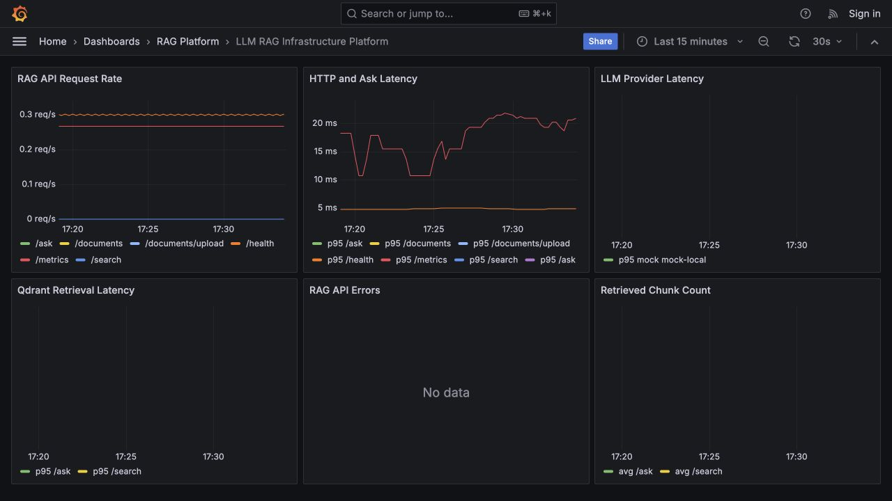
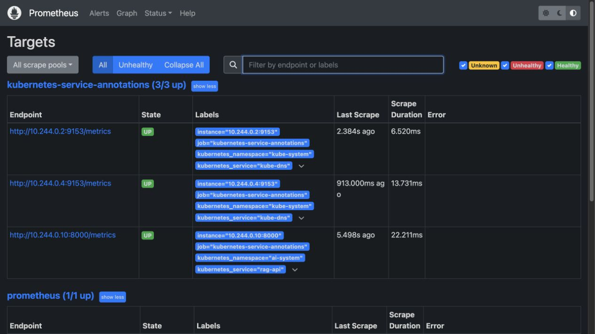
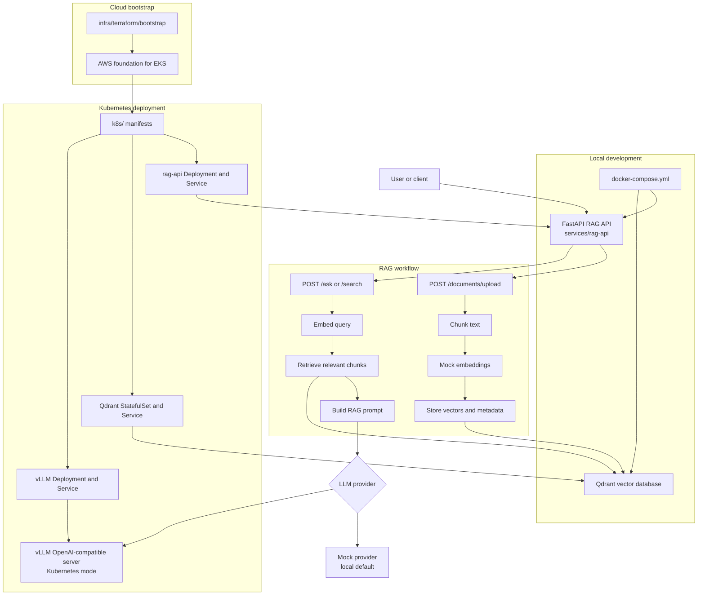

# LLM RAG Infrastructure Platform

[](https://github.com/SecureCloudOps/llm-rag-infra-platform/actions/workflows/rag-api-ci.yml)
[](https://github.com/SecureCloudOps/llm-rag-infra-platform/actions/workflows/k8s-validate.yml)
[](https://github.com/SecureCloudOps/llm-rag-infra-platform/actions/workflows/security-scan.yml)
[](LICENSE)
[](services/rag-api/pyproject.toml)
[](services/rag-api)
[](docker-compose.yml)
[](k8s/)
[](infra/terraform)

Author: Mohamed Mohamed

Production-style AI infrastructure platform for deploying a RAG API with
FastAPI, Qdrant, vLLM, Kubernetes, Terraform-managed AWS EKS infrastructure,
GitOps deployment, observability, autoscaling, and security scanning.

Built as a public, safe-to-share infrastructure portfolio project demonstrating
cloud-native AI platform engineering without exposing secrets, private
endpoints, cloud account IDs, or claims of a live production deployment.

## Verified Rebuild Evidence

The rebuild was reproduced on a dedicated Kind cluster without creating or
changing billable AWS resources.

- [Kind deployment and workload status](evidence/kind-deployment.md)
- [End-to-end RAG smoke-test results](evidence/application-smoke-test.md)
- [GitHub Actions and security-scan results](evidence/ci-security.md)
- [Terraform validation without apply](evidence/terraform-validation.md)
- [Complete evidence index and scope statement](evidence/README.md)

### Grafana RAG dashboard

[](evidence/screenshots/grafana-rag-dashboard.jpg)

### Prometheus targets

[](evidence/screenshots/prometheus-targets.jpg)

## What This Demonstrates

- End-to-end RAG API with document upload, chunking, vector search, generation,
  health checks, and Prometheus metrics
- Local Docker Compose path with Qdrant and mock inference for zero-key
  development
- Kubernetes deployment for the RAG API, Qdrant, vLLM, HPAs, network policies,
  Prometheus, and Grafana
- Terraform modules for EKS, networking, IAM, ECR, storage, and remote state
  bootstrap
- Argo CD GitOps application with sync-wave ordering for platform dependencies
- CI validation for Python tests, Docker image build, Kubernetes manifest
  rendering, and security scanning

## Architecture Overview



For more detail on component responsibilities and target deployment boundaries, see [`docs/architecture.md`](docs/architecture.md).

## Implemented Capabilities

- `services/rag-api`: FastAPI RAG service with health, document, search, ask, and Prometheus metrics endpoints
- `docker-compose.yml`: local RAG API and Qdrant environment with mock inference defaults
- `k8s`: Kubernetes manifests for app workloads, autoscaling, network policy, vLLM, and lightweight observability
- `k8s/argocd`: Argo CD application definition and GitOps rollout notes
- `infra/terraform`: AWS EKS-oriented infrastructure modules and dev environment composition
- `.github/workflows`: CI, Kubernetes validation, and security scanning workflows
- `docs/architecture.md`: architecture boundaries, component responsibilities, and deployment notes

Roadmap areas:

- Replace placeholder vLLM model settings with a documented public test model
- Add a dedicated ingestion service for larger document pipelines
- Promote Kubernetes manifests into environment-specific overlays or Helm charts
- Add production environment separation for Terraform state, sizing, and cluster access controls

## Repository Layout

```text
llm-rag-infra-platform/
├── README.md
├── .github/
│   └── workflows/
├── docs/
│   └── architecture.md
├── infra/
│   └── terraform/
│       ├── bootstrap/
│       ├── envs/
│       │   └── dev/
│       └── modules/
│           ├── ecr/
│           ├── eks/
│           ├── iam/
│           ├── networking/
│           └── storage/
├── k8s/
│   ├── argocd/
│   ├── observability/
│   ├── vllm/
│   ├── rag-api-deployment.yaml
│   ├── rag-api-service.yaml
│   ├── qdrant-statefulset.yaml
│   ├── networkpolicy.yaml
│   └── kustomization.yaml
├── services/
│   └── rag-api/
│       ├── app/
│       ├── tests/
│       ├── Dockerfile
│       ├── pyproject.toml
│       └── README.md
├── docker-compose.yml
└── rendered.yaml
```

## Run the RAG API Locally

### Docker Compose

From the repository root:

```bash
docker compose up --build
```

This starts:

- `rag-api` on <http://127.0.0.1:8000>
- `qdrant` on <http://127.0.0.1:6333>

The Compose configuration uses non-secret local defaults:

```text
QDRANT_URL=http://qdrant:6333
COLLECTION_NAME=documents
LLM_PROVIDER=mock
VLLM_BASE_URL=http://vllm:8001
MODEL_NAME=mistral-7b-instruct
```

Mock mode is the default and does not require vLLM or any API keys.

Check the API:

```bash
curl http://127.0.0.1:8000/health
```

Stop the stack:

```bash
docker compose down
```

If a host port is already in use, override only the host-side mapping:

```bash
QDRANT_HTTP_PORT=6335 QDRANT_GRPC_PORT=6336 docker compose up --build
```

Remove the local Qdrant volume as well:

```bash
docker compose down -v
```

### Docker Compose Smoke Test

With the Compose stack running, execute the repeatable end-to-end check from
the repository root:

```bash
scripts/compose-smoke-test.sh
```

The script waits for Qdrant and the RAG API, uploads the committed sample
document, verifies document statistics, exercises semantic search and the mock
RAG answer flow, and confirms that the expected Prometheus metrics are exposed.
Use `RAG_API_URL`, `QDRANT_HTTP_URL`, or `SMOKE_TEST_FILE` to override its local
defaults.

### Python

From `services/rag-api`:

```bash
python -m venv .venv
source .venv/bin/activate
pip install -e ".[dev]"
export LLM_PROVIDER=mock
uvicorn app.main:app --reload
```

Mock mode is the default and does not require vLLM. It returns deterministic
answers from the RAG API so local development and unit tests can run without an
LLM server.

Then call:

```bash
curl http://127.0.0.1:8000/health
```

Expected response:

```json
{"status":"ok","service":"rag-api"}
```

## Kubernetes vLLM Mode

The root Kubernetes manifests render the RAG API, Qdrant, and the vLLM service
in the `ai-system` namespace. In Kubernetes, `rag-api-config` switches the API
from local mock mode to vLLM:

```text
LLM_PROVIDER=vllm
VLLM_BASE_URL=http://vllm.ai-system.svc.cluster.local:8000/v1
MODEL_NAME=placeholder-local-model
```

`MODEL_NAME` intentionally matches the default in `k8s/vllm/configmap.yaml`.
The vLLM Deployment is paired with a dev HPA that keeps at least one placeholder
replica available. Set a real model before using it for inference:

```bash
kubectl set env deployment/vllm -n ai-system MODEL_NAME=your-public-test-model
```

Render or apply the Kubernetes stack from the repository root:

```bash
kubectl kustomize k8s/
kubectl apply -k k8s/
```

### Local Kind Deployment

The Kind overlay keeps the AWS-oriented base manifests unchanged while using
Kind's `standard` storage class, selecting mock inference, and omitting HPAs
because a default Kind cluster does not include Metrics Server.

Create a dedicated cluster and render the overlay:

```bash
kind create cluster --name llm-rag-platform-demo
kubectl kustomize --load-restrictor LoadRestrictionsNone deploy/kind \
  > /tmp/llm-rag-kind-rendered.yaml
kubectl apply -f /tmp/llm-rag-kind-rendered.yaml
```

Verify the workloads:

```bash
kubectl get pods,pvc,services -n ai-system
kubectl get pods,services -n observability
```

The vLLM Deployment intentionally remains at zero replicas in this local
overlay. The RAG API uses its deterministic mock provider, so the upload,
search, ask, and metrics workflow remains fully testable without a GPU.

## Autoscaling

The Kubernetes stack includes two `autoscaling/v2` HorizontalPodAutoscalers:

- `rag-api`: min `2`, max `5`, scales on CPU and memory utilization.
- `vllm`: min `1`, max `3`, scales on CPU as a portable dev default.

Qdrant remains a StatefulSet without an HPA. Vector databases need careful
capacity planning around storage, shard layout, and replication, so this dev
stack keeps Qdrant scaling explicit.

The vLLM HPA includes comments for the production path: GPU-serving workloads
should eventually scale from accelerator-aware metrics such as DCGM GPU
utilization, queue depth, tokens per second, or request latency exposed through
custom or external metrics.

## Observability

`k8s/observability/` deploys a lightweight Prometheus and Grafana stack in the
`observability` namespace. It uses ConfigMaps and anonymous local Grafana access
for a dev-friendly setup, and does not include real secrets.

Prometheus scrapes:

- `rag-api.ai-system.svc.cluster.local:8000/metrics`
- `vllm.ai-system.svc.cluster.local:8000/metrics` when vLLM exposes it
- Kubernetes pods and services annotated with `prometheus.io/scrape=true`

The RAG API exposes Prometheus metrics at `/metrics`:

```bash
curl http://127.0.0.1:8000/metrics
```

Open Grafana locally from a cluster:

```bash
kubectl port-forward -n observability svc/grafana 3000:3000
```

Then visit <http://127.0.0.1:3000>. The provisioned dashboard is named
`LLM RAG Infrastructure Platform`.

### AI Inference Latency Metrics

Inference latency is one of the main capacity signals for AI infrastructure.
CPU and memory show resource pressure, but generation latency shows the user
impact of model size, batching behavior, prompt length, retrieval quality, and
provider health.

The API records mock and vLLM provider latency separately with safe labels for
`provider` and `model_name`. In a portfolio demo, these metrics prove that the
platform can distinguish API latency, retrieval latency, model-provider latency,
retrieved context size, and error rate instead of treating every slow answer as
the same problem.

## Argo CD GitOps Deployment

Argo CD deploys the platform from `k8s/argocd/llm-rag-platform-app.yaml`, which points at the root `k8s/` kustomization. The root kustomization includes the `ai-system` namespace, Qdrant, vLLM, the RAG API, configuration, and network policies.

The manifests use Argo CD sync waves for dependency ordering:

- Wave `0`: namespace and ConfigMaps
- Wave `1`: Qdrant storage, Service, and StatefulSet
- Wave `2`: vLLM Deployment and Service
- Wave `3`: RAG API Deployment, Service, and NetworkPolicies
- Wave `4`: app HPAs after their target Deployments exist

Observability resources use wave `-1` so the namespace, Prometheus, Grafana,
RBAC, Services, and dashboards are created before app monitoring targets.

This ordering matters because the RAG API reads ConfigMaps, connects to Qdrant, and calls the vLLM service in Kubernetes mode. GitOps ordering reduces avoidable rollout noise by creating foundational resources and service dependencies before workloads that consume them.

See [`k8s/argocd/README.md`](k8s/argocd/README.md) for the dependency table and verification commands.

## Terraform Infrastructure

Terraform lives under `infra/terraform`:

- `bootstrap`: creates the S3 remote state bucket foundation.
- `envs/dev`: composes reusable modules into the dev EKS environment.
- `modules/networking`: VPC, public/private subnets, internet gateway, NAT Gateway topology, and route tables.
- `modules/eks`: EKS control plane, OIDC provider, managed add-ons, endpoint access settings, add-on IRSA, and managed node groups.
- `modules/ecr`: `rag-api` ECR repository with scan-on-push and immutable image tags by default.
- `modules/storage`: encrypted, versioned S3 bucket for uploaded documents.
- `modules/iam`: IRSA role and least-privilege document bucket policy for the `rag-api` service account.

The dev networking default is `single_nat_gateway = true` for cost control. A
production environment should set `single_nat_gateway = false` to create one NAT
Gateway per AZ and avoid a single-AZ egress dependency.

The EKS module manages pinned versions of `vpc-cni`, `coredns`, `kube-proxy`,
and `aws-ebs-csi-driver`. Review the pins whenever `cluster_version` changes.
Node capacity is split into independently configurable `system` and `workloads`
managed node groups.

The EKS API endpoint is private-only. Operators need an approved VPC access
path, such as VPN, bastion, or AWS Systems Manager, before they can administer
the cluster.

```hcl
cluster_endpoint_private_access = true
```

Remote state is intentionally bootstrapped first. Apply
`infra/terraform/bootstrap`, then copy `infra/terraform/envs/dev/backend.tf.example`
to `backend.tf` and fill in the generated state bucket before deploying dev.
The committed example uses S3 native lock files.

OIDC is enabled through the EKS module so Kubernetes service accounts and EKS
managed add-ons can assume AWS roles with IRSA. The AWS EBS CSI Driver add-on
uses its own role, and the `rag-api` service account should be annotated with
the `rag_api_role_arn` output to access the uploaded documents bucket without
static AWS credentials.

Deploy dev from `infra/terraform/envs/dev`:

```bash
cp terraform.tfvars.example terraform.tfvars
terraform init
terraform fmt -recursive
terraform validate
terraform plan
terraform apply
```

Before applying, replace placeholder CIDRs, tags, backend values, and any sizing
defaults that do not match the target AWS account. Future production
differences should include a separate state key and environment directory,
private-only endpoint access, one NAT Gateway per AZ, larger and reviewed node
capacity, reviewed add-on pins, and non-destructive storage settings.

## Switching LLM Providers

For local Docker Compose and Python development, keep mock mode:

```bash
export LLM_PROVIDER=mock
```

To point a local RAG API process at a compatible vLLM endpoint, switch the
provider and use the model served by vLLM:

```bash
export LLM_PROVIDER=vllm
export VLLM_BASE_URL=http://localhost:8000/v1
export MODEL_NAME=your-model-name
uvicorn app.main:app --reload
```

`LLM_PROVIDER` accepts `mock` or `vllm`. In vLLM mode, the API calls
the OpenAI-compatible chat completions endpoint. `VLLM_BASE_URL` may include
the `/v1` suffix, as shown above, or omit it.

## Run Tests

From `services/rag-api`:

```bash
pytest
```

## Security Scanning

Security validation runs on every `pull_request` and `push` in the
`Security Scan` GitHub Actions workflow. The workflow is scan-only and safe for
public repositories: it uses read-only repository permissions, does not require
GitHub secrets, does not authenticate to cloud providers, does not push images,
and does not deploy resources.

The workflow fails on explicit, auditable sets of Terraform and Kubernetes
hardening policies. Explicit check IDs avoid Checkov's API-key-only severity
filtering and keep architectural or cost-expanding policies subject to separate
review. Secret scanning fails when Gitleaks detects a committed secret.

Tools used:

- Trivy filesystem scan for vulnerabilities and misconfigurations
- Checkov for Terraform configuration
- Checkov for Kubernetes manifests
- Gitleaks for committed secret detection

Run the same scans locally from the repository root:

```bash
trivy fs --scanners vuln,misconfig,secret --severity HIGH,CRITICAL --exit-code 1 --ignore-unfixed .
checkov --directory infra/terraform --framework terraform \
  --check CKV_AWS_37,CKV_AWS_39,CKV_AWS_130,CKV_AWS_136,CKV_AWS_300
checkov --directory k8s --framework kubernetes \
  --check CKV_K8S_20,CKV_K8S_21,CKV_K8S_22,CKV_K8S_23,CKV_K8S_28,CKV_K8S_29,CKV_K8S_30,CKV_K8S_31,CKV_K8S_37,CKV_K8S_41,CKV_K8S_42,CKV_K8S_49
gitleaks detect --source . --config .gitleaks.toml --verbose
```

If the repository has no Terraform files yet, the GitHub Actions workflow skips
the Terraform Checkov scan. Locally, run the Terraform Checkov command after
Terraform configuration has been added.

## CI/CD

GitHub Actions validates the repository on `pull_request` and `push`:

- `RAG API CI` installs `services/rag-api` dependencies, runs the Python test suite, runs configured lint tools when present, and builds the API Docker image without pushing it.
- `Kubernetes Validate` runs `kubectl kustomize k8s/` to ensure the Kubernetes manifests render successfully.
- `Security Scan` runs Trivy, Checkov, and Gitleaks to catch high-severity
  vulnerabilities, infrastructure misconfigurations, Kubernetes manifest risks,
  and committed secrets.

The workflows are public-repository safe. They do not use secrets, authenticate
to cloud providers, push container images, deploy to Kubernetes, or make
automatic AWS changes.

## Public Repo Safety

Do not commit:

- AWS account IDs or resource ARNs from a real account
- API keys, tokens, kubeconfigs, or Terraform state
- Private endpoint URLs
- Customer, employer, or proprietary data

Use environment variables, local `.env` files excluded by `.gitignore`, and documented placeholders for configuration.

## License

This project is licensed under the MIT License. See [LICENSE](LICENSE).
