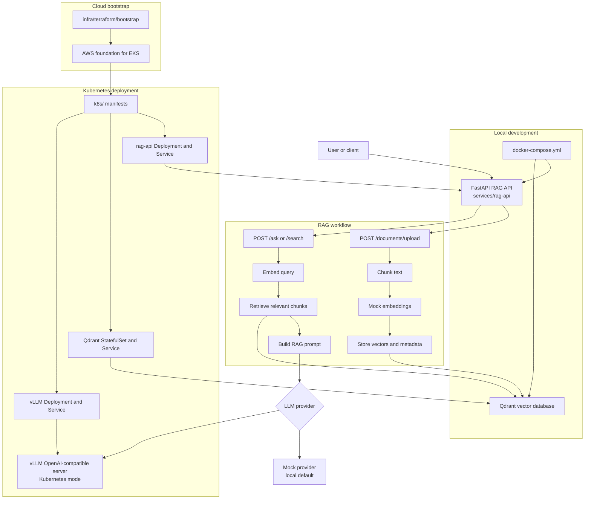

# LLM RAG Infrastructure Platform

[](https://github.com/SecureCloudOps/llm-rag-infra-platform/actions/workflows/rag-api-ci.yml)
[](https://github.com/SecureCloudOps/llm-rag-infra-platform/actions/workflows/k8s-validate.yml)
[](https://github.com/SecureCloudOps/llm-rag-infra-platform/actions/workflows/security-scan.yml)
[](LICENSE)
[](services/rag-api/pyproject.toml)
[](services/rag-api)
[](docker-compose.yml)
[](k8s/)
[](infra/terraform)

Author: Mohamed Mohamed

Production-style reference project for serving an open-source LLM with retrieval-augmented generation infrastructure.

The platform is intended to combine:

- vLLM for OpenAI-compatible inference serving
- Qdrant for vector search
- FastAPI for a RAG API layer
- Kubernetes manifests for application deployment
- Terraform for AWS EKS infrastructure

This repository is an infrastructure portfolio project. It is safe for public sharing and does not include secrets, cloud account IDs, private endpoints, or claims of a live production deployment.

## Architecture Overview



For more detail on component responsibilities and target deployment boundaries, see [`docs/architecture.md`](docs/architecture.md).

## Current Status

Initial scaffold:

- CI validates the RAG API tests, optional lint configuration, Docker image build, and Kubernetes manifest rendering
- `services/rag-api`: minimal FastAPI service with `GET /health`
- `docs/architecture.md`: target architecture and component responsibilities
- `infra/terraform`: Terraform entry point for cloud infrastructure
- `k8s`: Kubernetes manifest areas for platform components
- `.github/workflows`: CI/CD workflow definitions
- `scripts`: operational and developer helper scripts

Planned follow-up areas:

- `infra/terraform`: AWS EKS, networking, and managed infrastructure
- `k8s`: Kubernetes manifests or Helm charts
- `services/rag-api`: retrieval and generation endpoints
- `services/ingestion`: document ingestion and embedding pipeline

## Repository Layout

```text
llm-rag-infra-platform/
├── README.md
├── .github/
│   └── workflows/
├── docs/
├── infra/
│   └── terraform/
├── k8s/
│   ├── base/
│   ├── apps/
│   ├── qdrant/
│   ├── vllm/
│   └── observability/
├── scripts/
└── services/
    └── rag-api/
        ├── app/
        │   ├── __init__.py
        │   └── main.py
        ├── tests/
        │   └── test_health.py
        ├── pyproject.toml
        └── README.md
```

## Run the RAG API Locally

### Docker Compose

From the repository root:

```bash
docker compose up --build
```

This starts:

- `rag-api` on <http://127.0.0.1:8000>
- `qdrant` on <http://127.0.0.1:6333>

The Compose configuration uses non-secret local defaults:

```text
QDRANT_URL=http://qdrant:6333
COLLECTION_NAME=documents
LLM_PROVIDER=mock
VLLM_BASE_URL=http://vllm:8001
MODEL_NAME=mistral-7b-instruct
```

Mock mode is the default and does not require vLLM or any API keys.

Check the API:

```bash
curl http://127.0.0.1:8000/health
```

Stop the stack:

```bash
docker compose down
```

If a host port is already in use, override only the host-side mapping:

```bash
QDRANT_HTTP_PORT=6335 QDRANT_GRPC_PORT=6336 docker compose up --build
```

Remove the local Qdrant volume as well:

```bash
docker compose down -v
```

### Python

From `services/rag-api`:

```bash
python -m venv .venv
source .venv/bin/activate
pip install -e ".[dev]"
export LLM_PROVIDER=mock
uvicorn app.main:app --reload
```

Mock mode is the default and does not require vLLM. It returns deterministic
answers from the RAG API so local development and unit tests can run without an
LLM server.

Then call:

```bash
curl http://127.0.0.1:8000/health
```

Expected response:

```json
{"status":"ok","service":"rag-api"}
```

## Kubernetes vLLM Mode

The root Kubernetes manifests render the RAG API, Qdrant, and the vLLM service
in the `ai-system` namespace. In Kubernetes, `rag-api-config` switches the API
from local mock mode to vLLM:

```text
LLM_PROVIDER=vllm
VLLM_BASE_URL=http://vllm.ai-system.svc.cluster.local:8000/v1
MODEL_NAME=placeholder-local-model
```

`MODEL_NAME` intentionally matches the default in `k8s/vllm/configmap.yaml`.
The vLLM Deployment still defaults to `replicas: 0`, so set a real model and
scale it when you are ready to run inference:

```bash
kubectl set env deployment/vllm -n ai-system MODEL_NAME=your-public-test-model
kubectl scale deployment/vllm -n ai-system --replicas=1
```

Render or apply the Kubernetes stack from the repository root:

```bash
kubectl kustomize k8s/
kubectl apply -k k8s/
```

## Terraform Infrastructure

Terraform lives under `infra/terraform`:

- `bootstrap`: creates the S3 remote state bucket foundation.
- `envs/dev`: composes reusable modules into the dev EKS environment.
- `modules/networking`: VPC, public/private subnets, internet gateway, NAT Gateway topology, and route tables.
- `modules/eks`: EKS control plane, OIDC provider, managed add-ons, endpoint access settings, add-on IRSA, and managed node groups.
- `modules/ecr`: `rag-api` ECR repository with scan-on-push and immutable image tags by default.
- `modules/storage`: encrypted, versioned S3 bucket for uploaded documents.
- `modules/iam`: IRSA role and least-privilege document bucket policy for the `rag-api` service account.

The dev networking default is `single_nat_gateway = true` for cost control. A
production environment should set `single_nat_gateway = false` to create one NAT
Gateway per AZ and avoid a single-AZ egress dependency.

The EKS module manages pinned versions of `vpc-cni`, `coredns`, `kube-proxy`,
and `aws-ebs-csi-driver`. Review the pins whenever `cluster_version` changes.
Node capacity is split into independently configurable `system` and `workloads`
managed node groups.

The dev EKS API endpoint remains public but restricted by
`cluster_endpoint_public_access_cidrs`, with private endpoint access also
enabled. For private-only production, set:

```hcl
cluster_endpoint_public_access  = false
cluster_endpoint_private_access = true
```

Remote state is intentionally bootstrapped first. Apply
`infra/terraform/bootstrap`, then copy `infra/terraform/envs/dev/backend.tf.example`
to `backend.tf` and fill in the generated state bucket before deploying dev.
The committed example uses S3 native lock files.

OIDC is enabled through the EKS module so Kubernetes service accounts and EKS
managed add-ons can assume AWS roles with IRSA. The AWS EBS CSI Driver add-on
uses its own role, and the `rag-api` service account should be annotated with
the `rag_api_role_arn` output to access the uploaded documents bucket without
static AWS credentials.

Deploy dev from `infra/terraform/envs/dev`:

```bash
cp terraform.tfvars.example terraform.tfvars
terraform init
terraform fmt -recursive
terraform validate
terraform plan
terraform apply
```

Before applying, replace placeholder CIDRs, tags, backend values, and any sizing
defaults that do not match the target AWS account. Future production
differences should include a separate state key and environment directory,
private-only endpoint access, one NAT Gateway per AZ, larger and reviewed node
capacity, reviewed add-on pins, and non-destructive storage settings.

## Switching LLM Providers

For local Docker Compose and Python development, keep mock mode:

```bash
export LLM_PROVIDER=mock
```

To point a local RAG API process at a compatible vLLM endpoint, switch the
provider and use the model served by vLLM:

```bash
export LLM_PROVIDER=vllm
export VLLM_BASE_URL=http://localhost:8000/v1
export MODEL_NAME=your-model-name
uvicorn app.main:app --reload
```

`LLM_PROVIDER` accepts `mock` or `vllm`. In vLLM mode, the API calls
the OpenAI-compatible chat completions endpoint. `VLLM_BASE_URL` may include
the `/v1` suffix, as shown above, or omit it.

## Run Tests

From `services/rag-api`:

```bash
pytest
```

## Security Scanning

Security validation runs on every `pull_request` and `push` in the
`Security Scan` GitHub Actions workflow. The workflow is scan-only and safe for
public repositories: it uses read-only repository permissions, does not require
GitHub secrets, does not authenticate to cloud providers, does not push images,
and does not deploy resources.

The workflow fails on high or critical severity findings from infrastructure
and filesystem scanners. Secret scanning fails when Gitleaks detects a committed
secret.

Tools used:

- Trivy filesystem scan for vulnerabilities and misconfigurations
- Checkov for Terraform configuration
- Checkov for Kubernetes manifests
- Gitleaks for committed secret detection

Run the same scans locally from the repository root:

```bash
trivy fs --scanners vuln,misconfig,secret --severity HIGH,CRITICAL --exit-code 1 --ignore-unfixed .
checkov --directory . --framework terraform --check HIGH,CRITICAL
checkov --directory k8s --framework kubernetes --check HIGH,CRITICAL
gitleaks detect --source . --config .gitleaks.toml --verbose
```

If the repository has no Terraform files yet, the GitHub Actions workflow skips
the Terraform Checkov scan. Locally, run the Terraform Checkov command after
Terraform configuration has been added.

## CI/CD

GitHub Actions validates the repository on `pull_request` and `push`:

- `RAG API CI` installs `services/rag-api` dependencies, runs the Python test suite, runs configured lint tools when present, and builds the API Docker image without pushing it.
- `Kubernetes Validate` runs `kubectl kustomize k8s/` to ensure the Kubernetes manifests render successfully.
- `Security Scan` runs Trivy, Checkov, and Gitleaks to catch high-severity
  vulnerabilities, infrastructure misconfigurations, Kubernetes manifest risks,
  and committed secrets.

The workflows are public-repository safe. They do not use secrets, authenticate
to cloud providers, push container images, deploy to Kubernetes, or make
automatic AWS changes.

## Public Repo Safety

Do not commit:

- AWS account IDs or resource ARNs from a real account
- API keys, tokens, kubeconfigs, or Terraform state
- Private endpoint URLs
- Customer, employer, or proprietary data

Use environment variables, local `.env` files excluded by `.gitignore`, and documented placeholders for configuration.

## License

This project is licensed under the MIT License. See [LICENSE](LICENSE).
