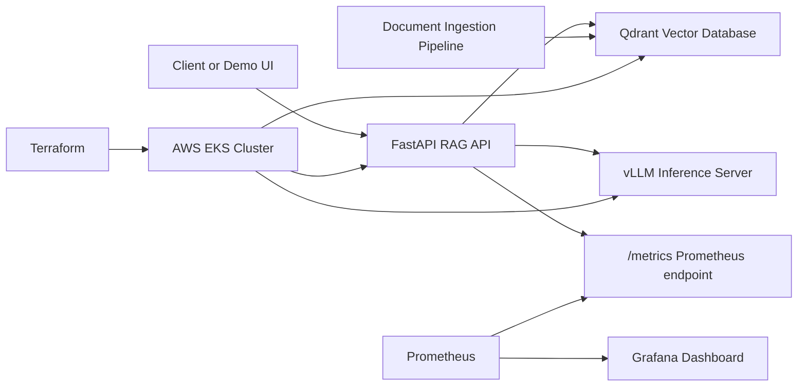

# Architecture

## Goal

The LLM RAG Infrastructure Platform demonstrates how to run a retrieval-augmented generation stack with separate concerns for inference, vector search, API orchestration, deployment, and cloud infrastructure.

The target deployment is AWS EKS managed with Terraform and Kubernetes. The repository includes a runnable RAG API, vector database manifests, vLLM placeholder serving, autoscaling, and lightweight observability.

## Target Components

## Component Responsibilities

### FastAPI RAG API

The API layer accepts user questions, retrieves relevant context from Qdrant, builds a prompt, calls vLLM for generation, and returns an answer with retrieval metadata.

Implemented endpoints:

- `GET /health` returns service health
- `POST /documents/upload` chunks and stores text documents
- `GET /documents` reports stored document and chunk counts
- `POST /search` returns ranked retrieval results
- `POST /ask` runs retrieval and answer generation
- `GET /metrics` exposes Prometheus metrics

### vLLM

vLLM will serve an open-source LLM through an OpenAI-compatible API. Model choice should remain configurable and documented without committing private model weights, credentials, or provider-specific secrets.

The vLLM placeholder Deployment has a CPU-based HPA for development. Production
GPU serving should use custom or external metrics such as GPU utilization,
queue depth, tokens per second, or p95 inference latency.

### Qdrant

Qdrant stores embeddings and document metadata for similarity search. Local development can use a containerized instance. Kubernetes deployment should use explicit storage configuration appropriate for the environment.

Qdrant remains a StatefulSet and is not autoscaled in this repo. Scaling vector
storage requires deliberate decisions about persistence, replication, and index
layout, so the portfolio stack keeps that operation manual.

### Terraform and EKS

Terraform will define AWS infrastructure such as networking, EKS, node groups, IAM roles, and supporting resources. Configuration must use variables and examples rather than real account identifiers.

### Kubernetes

Kubernetes manifests or Helm charts will define service deployments, configuration, health checks, resource requests, and internal service discovery.

The current manifests include:

- `rag-api` Deployment, Service, and HPA with CPU and memory scaling.
- `vllm` placeholder Deployment, Service, and HPA with CPU scaling.
- Qdrant StatefulSet, PVC, and Service without autoscaling.
- Lightweight Prometheus and Grafana resources under `k8s/observability/`.
- Argo CD sync waves that create observability first and HPAs after Deployments.

### Observability Architecture

Prometheus runs in the `observability` namespace and scrapes the RAG API
`/metrics` endpoint, vLLM `/metrics` if exposed, and annotated Kubernetes pods
or services. Grafana is provisioned from ConfigMaps with a dashboard for
request rate, HTTP latency, `/ask` latency, Qdrant retrieval latency, LLM
provider latency, retrieved chunk count, and error rate.

The RAG API tracks:

- HTTP request count and latency.
- End-to-end `/ask` latency.
- Qdrant retrieval latency.
- LLM provider latency labeled by provider and model name.
- Retrieved chunk count.
- Error count by endpoint and error type.

Inference latency matters because it isolates the model-serving part of the
RAG path. In a demo, high HTTP latency with low retrieval latency but high LLM
latency points at model serving, batching, model size, or provider health. High
retrieval latency points at vector database behavior. Separating these signals
makes the platform easier to operate than a single black-box request timer.

## Local Development Flow

1. Run Qdrant locally.
2. Run vLLM locally or point the API at a local compatible endpoint.
3. Start the FastAPI RAG API.
4. Run tests before changing deployment or API behavior.
5. Check metrics locally with `curl http://127.0.0.1:8000/metrics`.

## Security and Public Repository Guidelines

- Store secrets outside git.
- Commit `.env.example` files only with placeholder values.
- Keep Terraform state out of the repository.
- Avoid real AWS account IDs, private domains, or internal URLs.
- Make deployment claims only after reproducible deployment artifacts and validation steps exist.
