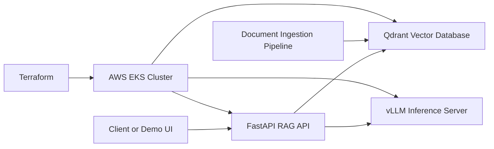

# Architecture

## Goal

The LLM RAG Infrastructure Platform demonstrates how to run a retrieval-augmented generation stack with separate concerns for inference, vector search, API orchestration, deployment, and cloud infrastructure.

The target deployment is AWS EKS managed with Terraform and Kubernetes. The current repository contains the first application scaffold only.

## Target Components

## Component Responsibilities

### FastAPI RAG API

The API layer accepts user questions, retrieves relevant context from Qdrant, builds a prompt, calls vLLM for generation, and returns an answer with retrieval metadata.

Initial implementation:

- `GET /health` returns service health

Planned endpoints:

- `POST /query` for RAG responses
- `POST /documents` for local demo ingestion
- `GET /ready` for dependency-aware readiness checks

### vLLM

vLLM will serve an open-source LLM through an OpenAI-compatible API. Model choice should remain configurable and documented without committing private model weights, credentials, or provider-specific secrets.

### Qdrant

Qdrant stores embeddings and document metadata for similarity search. Local development can use a containerized instance. Kubernetes deployment should use explicit storage configuration appropriate for the environment.

### Terraform and EKS

Terraform will define AWS infrastructure such as networking, EKS, node groups, IAM roles, and supporting resources. Configuration must use variables and examples rather than real account identifiers.

### Kubernetes

Kubernetes manifests or Helm charts will define service deployments, configuration, health checks, resource requests, and internal service discovery.

## Local Development Flow

1. Run Qdrant locally.
2. Run vLLM locally or point the API at a local compatible endpoint.
3. Start the FastAPI RAG API.
4. Run tests before changing deployment or API behavior.

## Security and Public Repository Guidelines

- Store secrets outside git.
- Commit `.env.example` files only with placeholder values.
- Keep Terraform state out of the repository.
- Avoid real AWS account IDs, private domains, or internal URLs.
- Make deployment claims only after reproducible deployment artifacts and validation steps exist.
